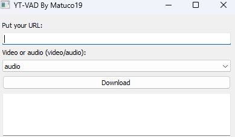

<center>  </center>


<h2> YT-VAD (YT Video/Audio Downloader) By Matuco19</h2>


<h3> About the project </h3>

<<<<<<< HEAD
This is a basic backend project of a YouTube video and audio downloader created in Python for learning. The downloaded content is moved to download folder in main script folder. 
=======
This is a basic backend project of a YouTube video and audio downloader created in Python for learning. More features will be added over time.
>>>>>>> db6d3c7c08ecd21dc3ecf3a47c09f49f9c41f703

>[!Warning]
>I am not responsible for its misuse, this project was created for educational purposes.

>[!TIP]
>The downloaded content is moved to download folder in main script folder.

I used the following modules: 

```
- pytube
- PyQt5
- sys
```

<h3> Roadmap </h3>

- [x] Add video support
- [x] Add audio support
- [x] Add UI


<h3> Screenshots </h3>




&copy; All Rights Reserved to Matuco19.
